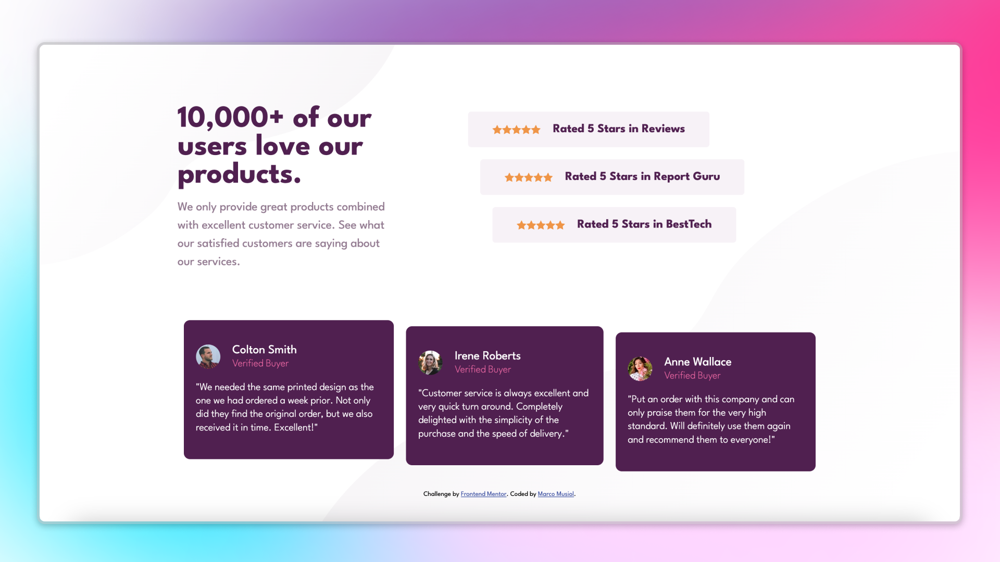
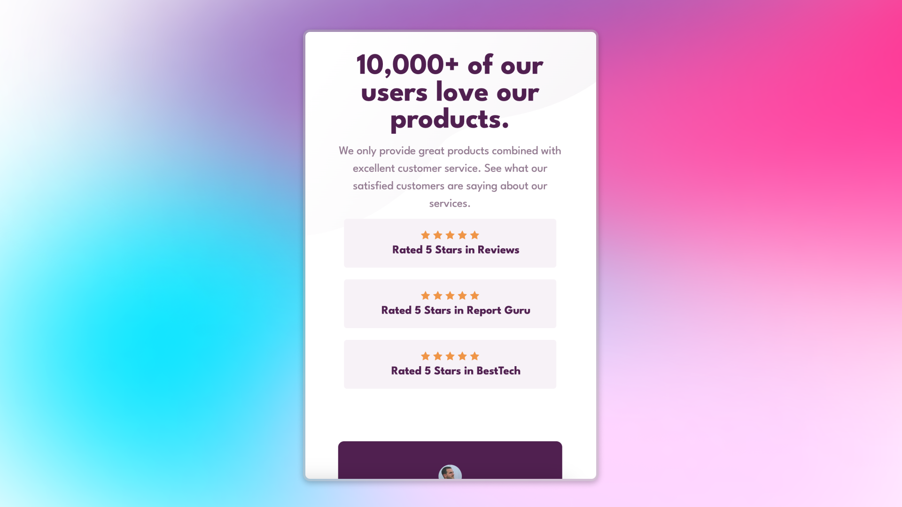

# Social Proof Section Solution 🌟

This is my solution for a [Frontend Mentor Challenge](https://www.frontendmentor.io) – a Social Proof Section. This project showcases user testimonials and ratings to build credibility and trust. It is built using **HTML5**, **CSS**, and **Flexbox**.

## 📸 Preview

## 🌐 Live Demo

Check out the live version here: [Live Site](https://musiolmarco.github.io/Social-Proof-Section/)

## 📂 Project Overview

This project focuses on creating a responsive and visually appealing section that highlights user reviews and ratings, helping to establish trust for a business or product.

### Features ✨

- Mobile-first responsive design
- Clean and semantic HTML5 structure
- Modern CSS styling with Flexbox
- Highlighted user testimonials and star ratings

## 🛠️ Built With

- **HTML5**
- **CSS**
- **Flexbox**

## 📖 What I Learned

- Structuring layouts with Flexbox
- Designing responsive components for mobile and desktop views
- Styling user testimonials and star ratings effectively

## 🖼️ Screenshot

## 🧑‍💻 Author

- Frontend Mentor Profile: [Your Name](https://www.frontendmentor.io/profile/yourusername)
- GitHub: [Your GitHub Profile](https://github.com/yourusername)

## 🙌 Acknowledgments

A big thanks to [Frontend Mentor](https://www.frontendmentor.io) for providing these awesome challenges to improve front-end development skills.

---

### 📝 Notes

Feel free to fork this project and make it your own. If you have any suggestions or improvements, please open an issue or submit a pull request!

Enjoy coding! 🎉
